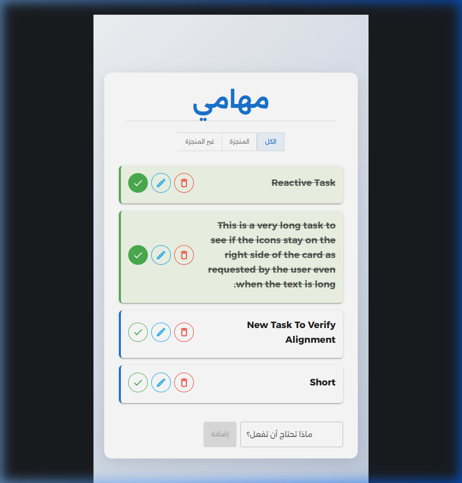

# 📝 TaskMaster - تطبيق إدارة المهام المتطور

<div align="center">


تطبيق متطور لإدارة المهام اليومية، تم بناؤه مع التركيز على تجربة مستخدم سلسة وتصميم عصري متجاوب باستخدام تقنيات React الحديثة وMaterial-UI.

[🌐 عرض حي للمشروع (Live Demo)](https://abdulmalekhatemm.github.io/DoListProjeticWithReact/)

</div>

---

## 📸 نظرة على المشروع

<div align="center">
  
</div>

---

## 🚀 التقنيات المستخدمة (Tech Stack)

تم استخدام أحدث التقنيات لضمان أداء عالٍ وكود نظيف قابل للتوسع:

*   **[React.js](https://reactjs.org/) (Vite)**: المكتبة الأساسية لبناء واجهات المستخدم بسرعة وكفاءة.
*   **[Material-UI (MUI)](https://mui.com/)**: لبناء واجهة مستخدم احترافية تدعم نظام **Material Design**.
*   **Context API**: لإدارة الحالة (State Management) بشكل مركزي للمهام والتنبيهات.
*   **LocalStorage**: لضمان حفظ البيانات واستمراريتها حتى بعد إغلاق المتصفح.
*   **MUI Icons**: لتوفير أيقونات تعبيرية واضحة للعمليات مثل الحذف والتعديل.

---

## ✨ المميزات الرئيسية (Features)

*   **✅ Full CRUD Operations**: إضافة، عرض، تعديل، وحذف المهام بكل سهولة.
*   **📅 Smart Filtering**: تصفية المهام بناءً على حالتها (الكل، المكتملة، غير المكتملة).
*   **📱 Responsive UI**: تصميم متجاوب تماماً يعمل بكفاءة على الجوال، الأجهزة اللوحية، والحاسوب.
*   **💾 Data Persistence**: حفظ تلقائي للمهام في الـ LocalStorage.
*   **🔔 User Notifications**: نظام تنبيهات (Snackbars) يوضح نتيجة كل إجراء (إضافة، تعديل، حذف).
*   **🎨 Professional Aesthetics**: استخدام تدرجات لونية، ظلال ناعمة، وانتقالات سلسة.
*   **🌍 RTL Support**: دعم كامل للغة العربية واتجاه القراءة من اليمين لليسار.

---

## 📂 هيكلية المجلدات (Project Structure)

```plaintext
src/
├── components/      # المكونات الرسومية الأساسية (TodoList, Todo, MySnackBar)
├── context/         # إدارة الحالات العالمية (TodosContext, ToastContext)
├── reducers/        # منطق تحديث الحالة (todoReducers) باستخدام useReducer
├── assets/          # الملفات الثابتة والصور
├── App.jsx          # المكون الرئيسي وتنسيق القوالب
└── main.jsx         # نقطة الإنطلاق وإعدادات الـ Providers
```

---

## 🛠️ التثبيت والتشغيل المحلي

يمكنك تشغيل المشروع على جهازك المحلي باتباع الخطوات التالية:

1. **استنساخ المستودع:**
   ```bash
   git clone https://github.com/abdulmalekhatemm/DoListProjeticWithReact.git
   ```

2. **الدخول إلى مجلد المشروع:**
   ```bash
   cd DoListProjeticWithReact
   ```

3. **تثبيت المكتبات المطلوبة:**
   ```bash
   npm install
   ```

4. **تشغيل المشروع في بيئة التطوير:**
   ```bash
   npm run dev
   ```

---

## 🧠 ما تعلمته في هذا المشروع (Key Takeaways)

*   إتقان استخدام **React Hooks** المتقدمة مثل `useReducer` مع `Context API`.
*   بناء واجهات مستخدم معقدة ومتجاوبة باستخدام **MUI Grid & Box System**.
*   التعامل مع منطق العمليات (CRUD) ومزامنتها مع المتصفح بشكل آمن.
*   تصميم واجهات تدعم الـ **RTL** بشكل احترافي ومنظم.
*   أهمية توفير "تغذية راجعة" (Feedback) فورية للمستخدم لتعزيز تجربة الاستخدام.

---

## 📧 التواصل

إذا كان لديك أي استفسار أو اقتراح، يسعدني تواصلك معي:

*   **البريد الإلكتروني:** [your-email@example.com]
*   **LinkedIn:** [linkedin.com/in/abdulmalek-hatem]
*   **GitHub:** [@abdulmalekhatemm](https://github.com/abdulmalekhatemm)

---

<div align="center">
  <p>تم التطوير بكل ❤️ لتقديم أفضل تجربة إدارة مهام.</p>
  <b>شكراً لزيارتك للمستودع!</b>
</div>